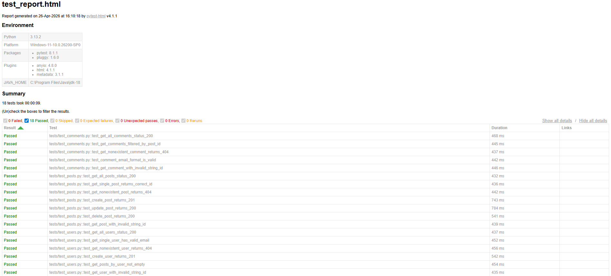

# REST API Test Suite – Python & Postman

Automated API test suite for the [JSONPlaceholder](https://jsonplaceholder.typicode.com) REST API,
built as part of a QA engineering portfolio project.

---

## 🎯 Project Goal

Demonstrate practical API testing skills using industry-standard tools:

* Structured test case design (positive & negative scenarios)
* HTTP response validation (status codes, response body, data format)
* Automated test execution with CI (GitHub Actions)
* Manual API testing using Postman

---

## 🛠️ Tools & Technologies

| Tool        | Purpose                        |
| ----------- | ------------------------------ |
| Python 3.x  | Test scripting language        |
| pytest      | Test framework and test runner |
| requests    | HTTP library for API calls     |
| pytest-html | HTML test report generation    |
| Postman     | Manual API testing             |

---

## 📁 Project Structure

```
api-test-suite/
│
├── tests/
│   ├── test_posts.py
│   ├── test_users.py
│   └── test_comments.py
│
├── postman/
│   └── api_test_collection.json
│
├── conftest.py
├── requirements.txt
├── .gitignore
└── README.md
```

> Note: The `reports/` folder is generated locally when running tests and is excluded via `.gitignore`.

---

## 🧪 Test Cases Overview

### /posts — 7 Test Cases

| # | Test                            | Type     | Expected                           |
| - | ------------------------------- | -------- | ---------------------------------- |
| 1 | GET all posts                   | Positive | Status 200, non-empty list         |
| 2 | GET single post by ID           | Positive | Status 200, correct ID and fields  |
| 3 | GET non-existent post           | Negative | Status 404                         |
| 4 | POST create new post            | Positive | Status 201, data matches payload   |
| 5 | PUT update existing post        | Positive | Status 200, updated data reflected |
| 6 | DELETE post                     | Positive | Status 200, empty response body    |
| 7 | GET post with invalid string ID | Negative | Status 404                         |

---

### /users — 6 Test Cases

| # | Test                            | Type     | Expected                         |
| - | ------------------------------- | -------- | -------------------------------- |
| 1 | GET all users                   | Positive | Status 200, list of users        |
| 2 | GET single user, validate email | Positive | Status 200, valid email format   |
| 3 | GET non-existent user           | Negative | Status 404                       |
| 4 | POST create new user            | Positive | Status 201, data matches payload |
| 5 | GET posts by user               | Positive | Status 200, correct userId       |
| 6 | GET user with invalid string ID | Negative | Status 404                       |

---

### /comments — 5 Test Cases

| # | Test                               | Type     | Expected                       |
| - | ---------------------------------- | -------- | ------------------------------ |
| 1 | GET all comments                   | Positive | Status 200, non-empty list     |
| 2 | GET comments filtered by postId    | Positive | Status 200, correct postId     |
| 3 | GET non-existent comment           | Negative | Status 404                     |
| 4 | GET comment, validate email format | Positive | Status 200, valid email format |
| 5 | GET comment with invalid string ID | Negative | Status 404                     |

---

**Total: 18 test cases (12 positive, 6 negative)**

---

## ▶️ How to Run

### 1. Clone repository

```bash
git clone https://github.com/ali-awlad-tuc/api-test-suite.git
cd api-test-suite
```

### 2. Install dependencies

```bash
pip install -r requirements.txt
```

### 3. Run tests

```bash
pytest tests/ -v
```

### 4. Generate HTML report (optional)

```bash
pytest tests/ -v --html=reports/test_report.html --self-contained-html
```

### 5. Run a specific test file
```bash
pytest tests/test_posts.py -v
```

---

## 📊 Sample Test Output

```
tests/test_comments.py::test_get_all_comments_status_200                 PASSED
tests/test_comments.py::test_get_comments_filtered_by_post_id            PASSED
tests/test_comments.py::test_get_nonexistent_comment_returns_404         PASSED
tests/test_comments.py::test_comment_email_format_is_valid               PASSED
tests/test_comments.py::test_get_comment_with_invalid_string_id          PASSED
tests/test_posts.py::test_get_all_posts_status_200                       PASSED
tests/test_posts.py::test_get_single_post_returns_correct_id             PASSED
tests/test_posts.py::test_get_nonexistent_post_returns_404               PASSED
tests/test_posts.py::test_create_post_returns_201                        PASSED
tests/test_posts.py::test_update_post_returns_200                        PASSED
tests/test_posts.py::test_delete_post_returns_200                        PASSED
tests/test_posts.py::test_get_post_with_invalid_string_id                PASSED
tests/test_users.py::test_get_all_users_status_200                       PASSED
tests/test_users.py::test_get_single_user_has_valid_email                PASSED
tests/test_users.py::test_get_nonexistent_user_returns_404               PASSED
tests/test_users.py::test_create_user_returns_201                        PASSED
tests/test_users.py::test_get_posts_by_user_not_empty                    PASSED
tests/test_users.py::test_get_user_with_invalid_string_id                PASSED

====== 18 passed in 3.42s ======
```

---

## 📊 Test Report



---

## ⚙️ Continuous Integration

Tests run automatically on every push using **GitHub Actions**.

* Ensures tests always pass
* Detects failures early
* Demonstrates real-world CI workflow

---

## 📬 Postman Collection

The Postman collection mirrors the API test scenarios.

**Import steps:**

1. Open Postman
2. Click **Import**
3. Select `postman/api_test_collection.json`
4. Run via Collection Runner

---

## 👤 Author

**Md Ali Awlad**
Technische Universität Chemnitz
[LinkedIn](https://www.linkedin.com/in/aliawlad) · Chemnitz, Deutschland
